# 09-ci-04-jenkins

## Подготовка к выполнению

### Terraform - подготовка виртуальных машин
``` sh
terraform apply
```
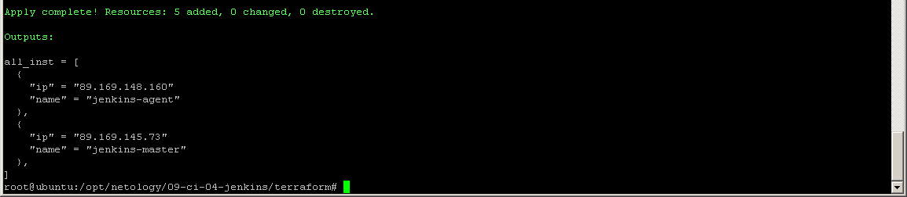

### Ansible - подготовка конфигураций

Используются дистрибутивы (./playbook/group_vars/jenkins.yml):

- Java JDK 17.0.12 (java_download_url: "https://download.oracle.com/java/17/archive/jdk-17.0.12_linux-x64_bin.rpm")

- Jenkins 2.440.1 (jenkins_download_url: "https://archives.jenkins.io/redhat-stable/jenkins-2.440.1-1.1.noarch.rpm")
``` sh
ansible-playbook -i ./inventory/hosts.yml site.yml
```

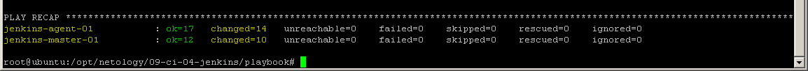

В браузере http://xxx.xxx.xxx.xxx:8080/

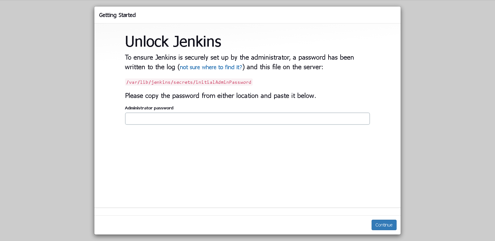

### Jenkins - запуск, первоначальная настройка и проверка работоспособности

Для разблокировки Jenkins, в поле вставляем содержимое файла по указанному пути в виртуальной машины jenkins-master-01:
```sh
ssh xxx.xxx.xxx.xxx
sudo -i
cat /var/lib/jenkins/secrets/initialAdminPassword
```

Устанавливаем плагины:

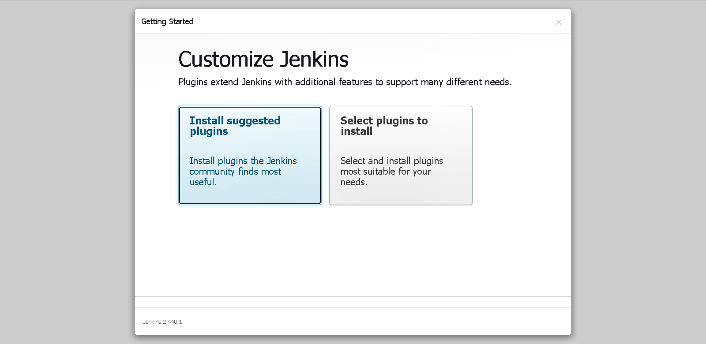

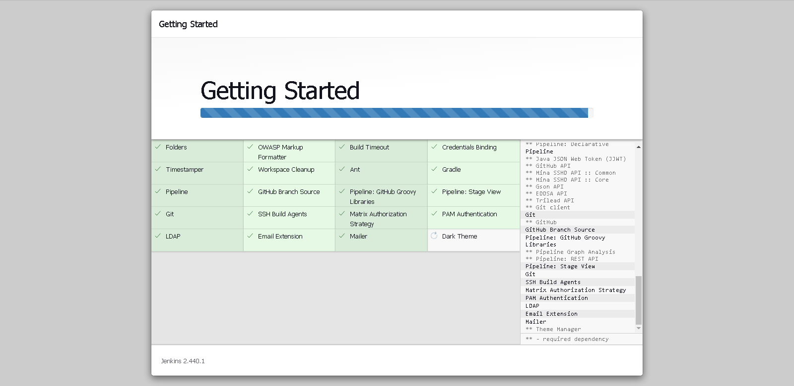

Вводим имя пользователя, пароль, данные и почту пользователя:

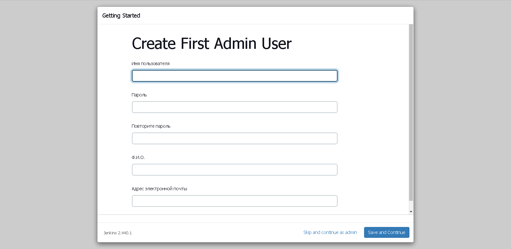

, и попадаем на стартовую страницу Jenkins:

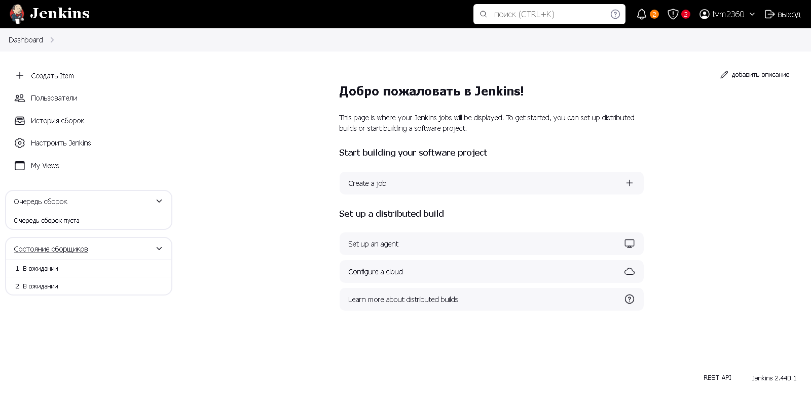

Добавляем агента:

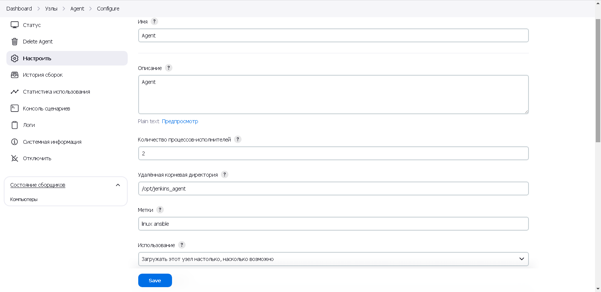

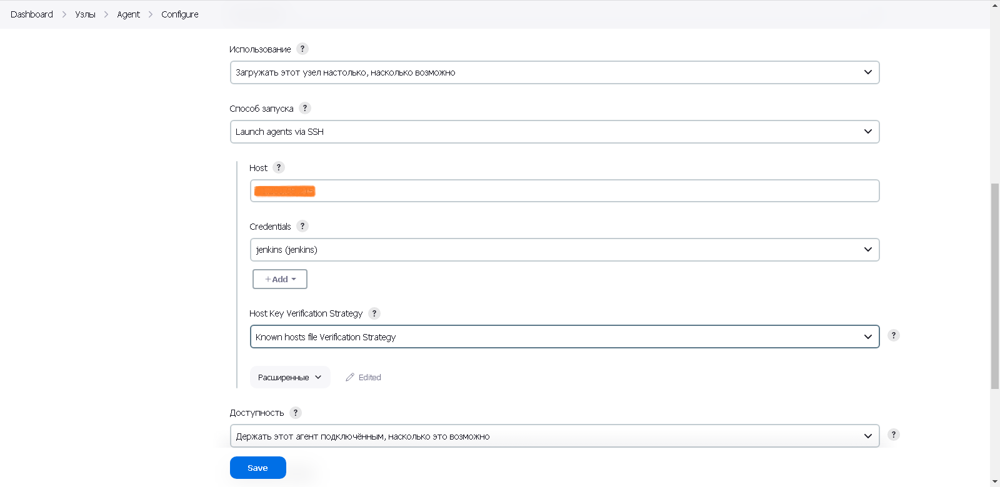

 - Имя, описание: любое
 - Количество процессов исполнителей: кол-во процессорных потоков
 - Удаленная корневая директория: из значения переменной jenkins_agent_dir в ./playbook/group_vars/jenkins.yml
 - Метки: на свое усмотрение
 - Способ запуска: Launch agents via SSH
 - реквизиты для входа:

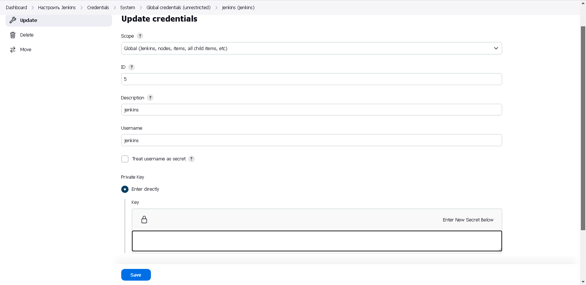

 - Kind: SSH Username with private key;
 - id: любой
 - description: любой
 - username: jenkins
 - Private Key => Enter directly => Key => Add: В поле вставить содержимое ~/.ssh/id_rsa виртуальной машины jenkins-master 

Разрешаем входящие соединения от агентов:

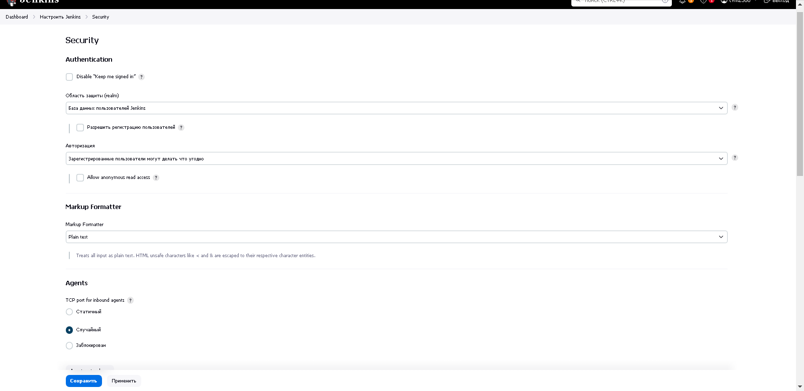

Состояние агентов:

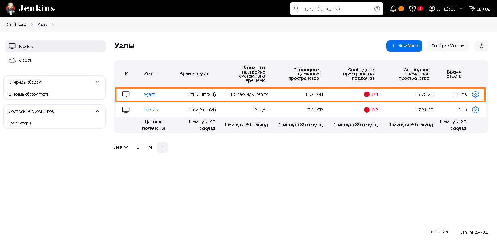

## Основная часть

### 1. Freestyle Job

Шаги:
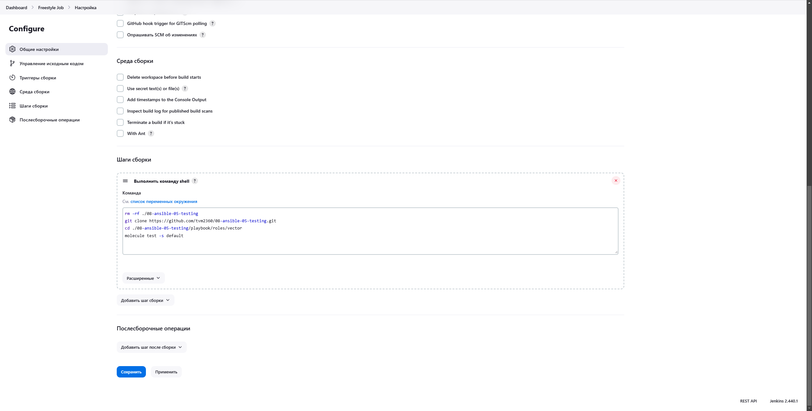

Результат:
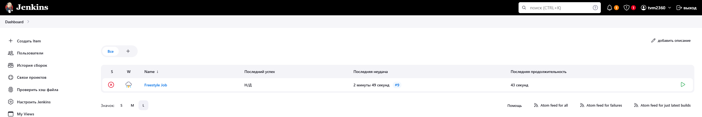

Протокол: [FreestyleResultProtocol](./add/1_Freestyle_Result_Prot.txt)

### 2. Declarative Pipeline Job

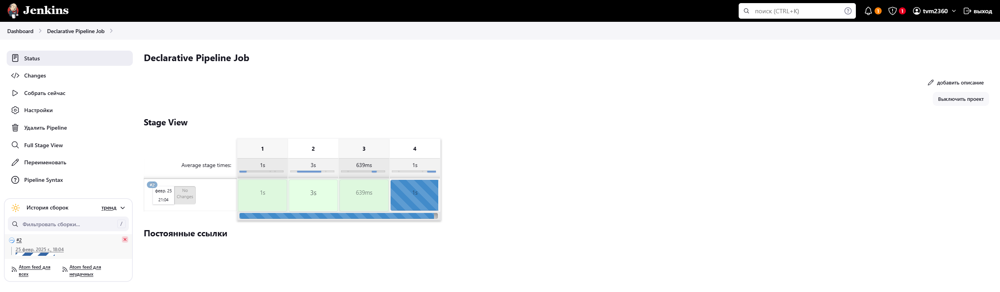

Шаги:
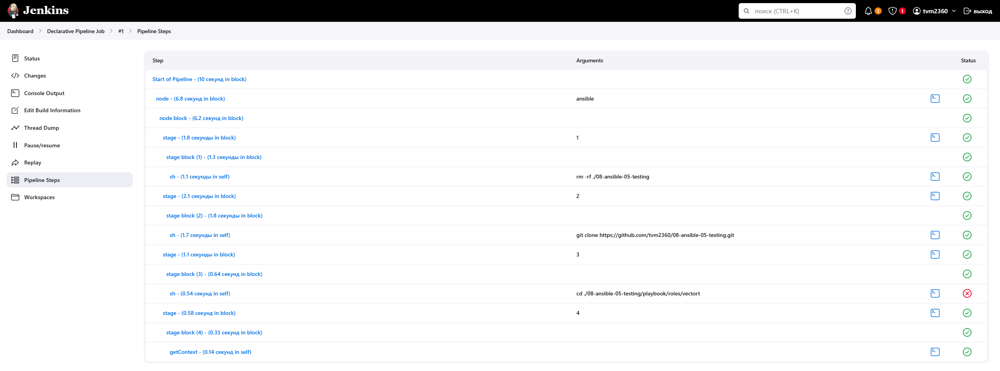

Результат:
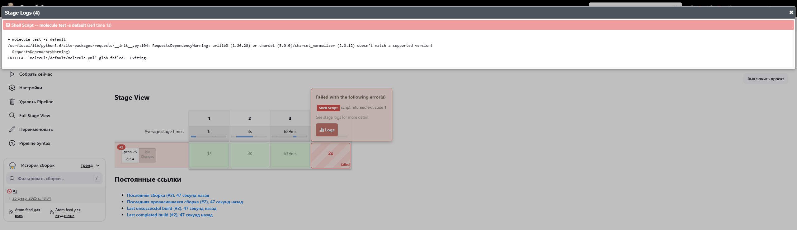


