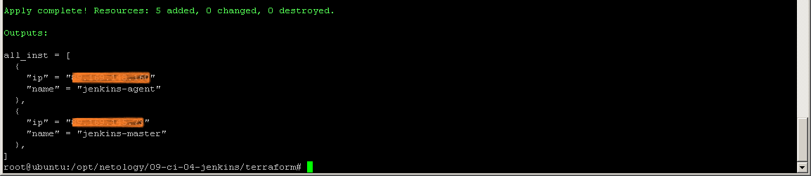

# 09-ci-04-jenkins

## Подготовка к выполнению

### Terraform - подготовка виртуальных машин

``` sh
terraform apply
```


### Ansible - подготовка конфигураций

Используются дистрибутивы (./playbook/group_vars/jenkins.yml):

- Java JDK 17.0.12 (java_download_url: "https://download.oracle.com/java/17/archive/jdk-17.0.12_linux-x64_bin.rpm")

- Jenkins 2.440.1 (jenkins_download_url: "https://archives.jenkins.io/redhat-stable/jenkins-2.440.1-1.1.noarch.rpm")

``` sh
ansible-playbook -i ./inventory/hosts.yml site.yml
```


В браузере http://89.169.145.73:8080/


Для разблокировки Jenkins, в поле вставляем содержимое файла по указанному пути в виртуальной машины jenkins-master-01:

```sh
ssh 89.169.145.73
sudo -i
cat /var/lib/jenkins/secrets/initialAdminPassword
```
Устанавливаем плагины:


Вводим имя пользователя, пароль, данные и почту пользователя, и попадаем на стартовую страницу Jenkins:


